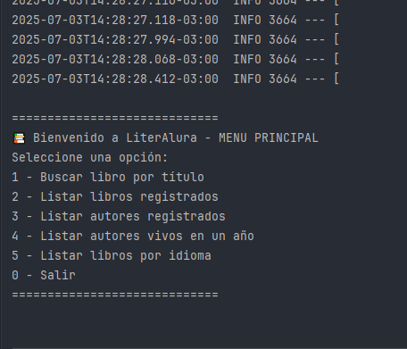

# LiterAlura 📚

**LiterAlura** es una aplicación de consola desarrollada en Java con Spring Boot que permite buscar, guardar y explorar libros del proyecto [GutenDex API](https://gutendex.com/). El proyecto fue realizado como parte del desafío de Alura Latam: *"Inmersión Java Spring 2024"*.

---

## 🚀 Funcionalidades principales

- 🔍 Buscar un libro por título y guardarlo si no está registrado.
- 📚 Listar todos los libros registrados.
- ✍️ Listar todos los autores registrados.
- 📅 Listar autores vivos en un año específico.
- 🌐 Filtrar libros por idioma (en, es, fr, pt).

---

## 🛠 Tecnologías utilizadas

- Java 17
- Spring Boot 3
- PostgreSQL
- JPA (Hibernate)
- Gutendex API
- Maven

---

## 📦 Instalación paso a paso

1. Cloná el repositorio:

```bash
git clone https://github.com/tuUsuario/literalura.git
cd literalura
```
2. Configurá las variables de entorno en el archivo application.properties:
```bash
spring.datasource.url=jdbc:postgresql://localhost:5432/base_libros
spring.datasource.username=tu_usuario
spring.datasource.password=tu_password
spring.jpa.hibernate.ddl-auto=update
```
3. Asegurate de tener PostgreSQL corriendo y una base de datos creada.
4. Ejecutá el proyecto desde tu IDE o consola:
```bash
./mvnw spring-boot:run
```
🧪 Aprendizajes:
Uso de Spring Boot con aplicaciones de consola.

.Integración con API externa (GutenDex).

.Persistencia de datos con Spring Data JPA.

.Manejo de relaciones ManyToMany con entidades Libro y Autor.

.Lectura de JSON con ObjectMapper.

🛠️ Posibles mejoras futuras:
.Agregar sección para libros favoritos y poder borrar alguno.

.Añadir filtros combinados (autor + idioma).

.Exportar listado de libros favoritos a archivo .csv o .txt.

🖼️ Capturas del proyecto



🤝 Autor

.Desarrollado por Franco Daniel Luvisotti Junco como parte del desafío LiterAlura 🚀